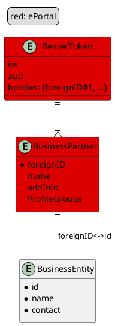

# SWIYU Core Business Service

The service contains the business logic to implement the use cases and acts as a middleware between the registries
and the internet with a strong focus on security aspects.

## Getting Started

The swiyu-core-business-service has the entire local kafka setup needed in
the [docker-compose.local.yml](docker-compose.local.yml)
file which is reused by the other services. To develop locally do the following:

1. Start the core-business-service via Intellij (-> docker compose up is done automatically ) or via mvn command

**Local Profile** (uses registries in DEV stage and PAMS mock)

```shell
mvn spring-boot:run -Dspring-boot.run.profiles=local
```

**Shared Profile** (expects registries to run locally under localhost)

```shell
mvn spring-boot:run -Dspring-boot.run.profiles=local,shared
```


2. Access confluent to observe the messages / topcis on [http://localhost:9021/clusters](http://localhost:9021/clusters)


Limitations: The access to PAMS is mocked with local profile. When creating a BusinessPartner with this approach,
the entity will not be registered at any external access system. In order to not mock anything start the
app without local profile and configure all Environment Variables mentioned in application.yml.

## Overview



## Authentication & ePortal Integration

For an overview of roles, profiles and how they interact with the ePortal see confluence:
[https://confluence.bit.admin.ch/display/EIDTGM/ePortal+Integration+for+ecosystem+Portal](https://confluence.bit.admin.ch/x/BcPiLg)
