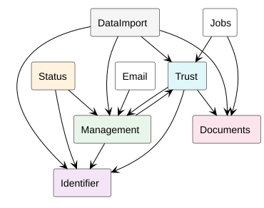
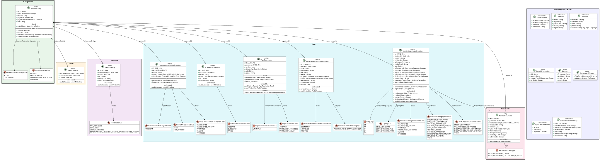
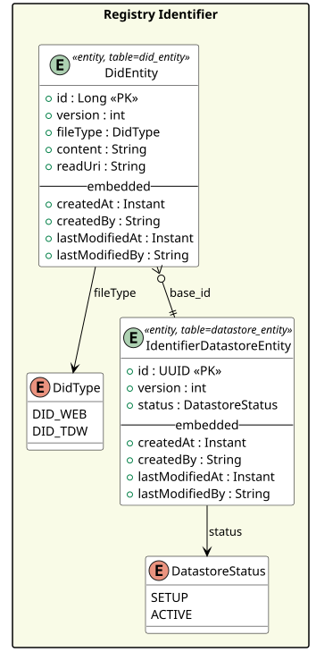
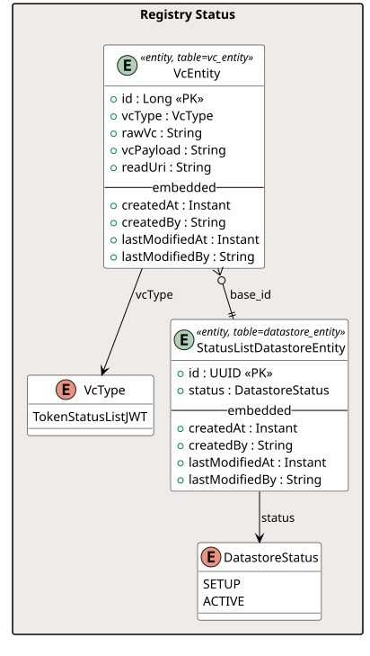

## Core Business Modules

Module dependency diagram illustrating the internal structure and component boundaries of the core business service.

---

## Core Business Domain Model

Overall domain model of the core business service, showing the main entities and their relationships.

---

## Registry Identifier Domain Model

Domain model focused on registry identifiers, detailing how identifiers are structured and related within the registry.

---

## Registry Status Domain Model

Domain model for registry status, capturing the states and transitions relevant to registry entries.

